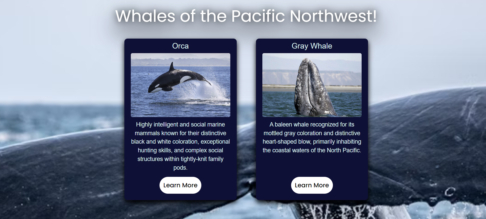
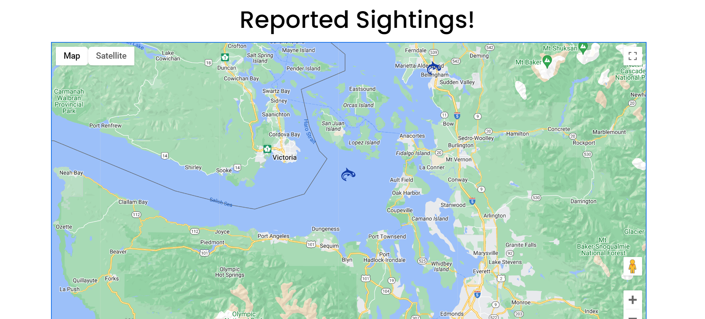
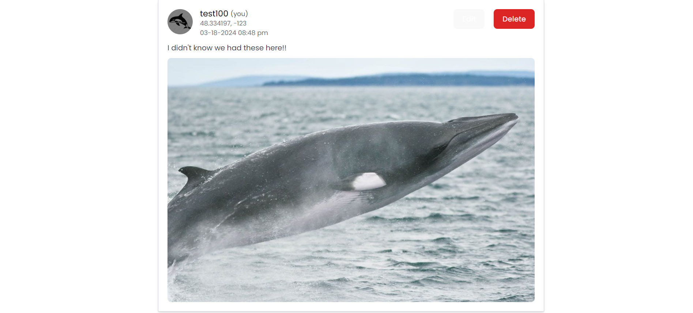

<!-- Improved compatibility of back to top link: See: https://github.com/othneildrew/Best-README-Template/pull/73 -->
<a name="readme-top"></a>
<!--
*** Thanks for checking out the Best-README-Template. If you have a suggestion
*** that would make this better, please fork the repo and create a pull request
*** or simply open an issue with the tag "enhancement".
*** Don't forget to give the project a star!
*** Thanks again! Now go create something AMAZING! :D
-->


<!-- PROJECT SHIELDS -->
<!--
*** I'm using markdown "reference style" links for readability.
*** Reference links are enclosed in brackets [ ] instead of parentheses ( ).
*** See the bottom of this document for the declaration of the reference variables
*** for contributors-url, forks-url, etc. This is an optional, concise syntax you may use.
*** https://www.markdownguide.org/basic-syntax/#reference-style-links
-->

<!-- PROJECT LOGO -->
<br />
<div align="center">
  <a href="https://github.com/fiko-dev/csci342-orca_whale_database">
    
  </a>

<h3 align="center">PNW Whale Tracker</h3>

  <p align="center">
    Our project, the PNW Whale Tracker, aims to create a way for people to engage with and learn about the Southern Resident orcas of the Pacific Northwest. Designed to enhance the whale-watching experience, our application provides a comprehensive database of information and images of orcas and other species of whales.
    <br />
  </p>
</div>


<!-- TABLE OF CONTENTS -->
<details>
  <summary>Table of Contents</summary>
  <ol>
    <li>
      <a href="#about-the-project">About The Project</a>
      <ul>
        <li><a href="#built-with">Built With</a></li>
      </ul>
    </li>
    <li>
      <a href="#getting-started">Getting Started</a>
      <ul>
        <li><a href="#prerequisites">Prerequisites</a></li>
        <li><a href="#installation">Installation</a></li>
      </ul>
    </li>
    <li><a href="#Preview">Preview</a></li>
    <li><a href="#contributors">contributors</a></li>
    <li><a href="#acknowledgments">Acknowledgments</a></li>
  </ol>
</details>


<!-- ABOUT THE PROJECT -->
## About The Project


<p align="right">(<a href="#readme-top">back to top</a>)</p>


### Built With

* [![React][React.js]][React-url]
* [![Mongodb][Mongodb.com]][Mongodb-url]
* [![JavaScript][JavaScript.com]][JavaScript-url]
* [![Node][Node.js]][Node-url]
* [![Express][Express.com]][Express-url]
* [![Tailwind][Tailwind CSS]][Tailwind-url]
* [![AWS][AWS.com]][AWS-url]
* [![Vitest][Vitest.com]][Vitest-url]

<p align="right">(<a href="#readme-top">back to top</a>)</p>


<!-- GETTING STARTED -->
## Getting Started

This is an example of how you may give instructions on setting up your project locally.
To get a local copy up and running follow these simple example steps.

### Prerequisites

This is an example of how to list things you need to use the software and how to install them.
* npm
  ```sh
  npm install npm@latest -g
  ```

### Installation

1. Clone the repo
   ```sh
   git clone https://github.com/github_username/repo_name.git
   ```
2. Install NPM packages in root directory
   ```sh
   npm run dep
   ```
3. Start server in root directory
  ```sh
   npm run server
   ```
4. Start client in root directory (in another terminal)
  ```sh
   npm run client
   ```
5. Open application in browser
  ```sh
   http://localhost:5173/
   ```
<p align="right">(<a href="#readme-top">back to top</a>)</p>


<!-- How to run the application locally:
  1. Clone the repository into a local directory
  2. Run 'npm run dep' in the directort's command line to install all of the dependencies required to run the application
  3. Run 'npm start' in the root directory to start the server
  4. Run 'npm run client' in the root directory in a separate terminal to start the client
  5. Open http://localhost:5173/ in your browser to run the application>
-->
## Preview






## Contributors

* Jed Pagcaliwagan
* Liam Rock
* Kham Sang
* Dima Melnik
* Christopher Farrer
* Thomas Ng

<p align="right">(<a href="#readme-top">back to top</a>)</p>


<!-- MARKDOWN LINKS & IMAGES -->
<!-- https://www.markdownguide.org/basic-syntax/#reference-style-links -->
[contributors-url]: https://github.com/fiko-dev/csci342-orca_whale_database/graphs/contributors
[React.js]: https://img.shields.io/badge/React-20232A?style=for-the-badge&logo=react&logoColor=61DAFB
[React-url]: https://reactjs.org/
[Mongodb.com]: https://img.shields.io/badge/MongoDB-green
[Mongodb-url]: https://www.mongodb.com/
[Javascript.com]: https://img.shields.io/badge/JavaScript-yellow
[JavaScript-url]: https://www.javascript.com/
[Node.js]:https://img.shields.io/badge/Node.js-lime
[Node-url]: https://nodejs.org/en
[Express.com]: https://img.shields.io/badge/Express.js-white
[Express-url]: https://expressjs.com/
[Tailwind CSS]: https://img.shields.io/badge/Tailwind%20CSS-cyan
[Tailwind-url]: https://tailwindcomponents.com/
[AWS.com]: https://img.shields.io/badge/AWS-orange
[AWS-url]: https://aws.amazon.com/free/?gclid=CjwKCAjwzN-vBhAkEiwAYiO7oHkgFolt9Ek0XecZL4n_gfpQWahuzzo8ve1RvBkpokOAcXgPjl7GCxoCHpAQAvD_BwE&trk=6a4c3e9d-cdc9-4e25-8dd9-2bd8d15afbca&sc_channel=ps&ef_id=CjwKCAjwzN-vBhAkEiwAYiO7oHkgFolt9Ek0XecZL4n_gfpQWahuzzo8ve1RvBkpokOAcXgPjl7GCxoCHpAQAvD_BwE:G:s&s_kwcid=AL!4422!3!651751059783!e!!g!!aws!19852662197!145019195897&all-free-tier.sort-by=item.additionalFields.SortRank&all-free-tier.sort-order=asc&awsf.Free%20Tier%20Types=*all&awsf.Free%20Tier%20Categories=*all
[Vitest.com]: https://img.shields.io/badge/Vitest-Yellow
[Vitest-url]: https://vitest.dev/
